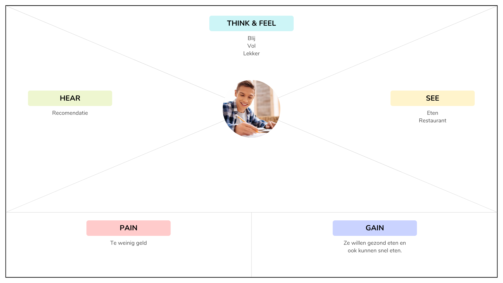

# Fase 1: Empathize (Begrijp de gebruiker)
## 1. Doelgroeponderzoek

* **Wie is onze gebruiker?**
  Gen Z studenten vooral op de jongeren tussen de 16 en 26 jaar.

* **Pijnpunten (Pains):**
  Te weinig geld.
  

* **Behoeftes (Gains):**
  Ze willen gezond eten en ook kunnen snel eten.

  
## 2. Empathy Map (Visueel)

  
## 3. Conclusie
*Wat is het belangrijkste inzicht dat we meenemen naar de Define fase?*
* Het belangrijkste inzicht dat we meenemen naar de Define-fase is een diepgaand begrip van de gebruiker, specifiek hun werkelijke behoeften, pijnpunten en onuitgesproken motivaties die zijn ontdekt tijdens de Empathize-fase
